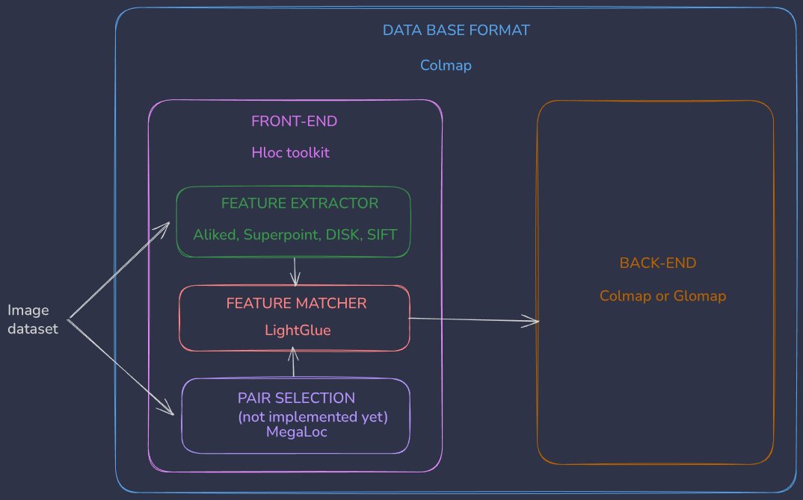

# Reconstruction Pipeline: HLOC + GLOMAP / COLMAP

This pipeline automates the creation of a sparse 3D reconstruction from a set of images using modern deep learning features (ALIKED + LightGlue by default) and a global (GLOMAP) or incremental (COLMAP) structure-from-motion mapper.

> **Note**: This pipeline uses everything compiled from source with CUDA support for optimal performance.
> 
## Overview


The pipeline performs the following steps:
1.  **Feature Extraction**: Extracts keypoints using **ALIKED** (default), SuperPoint, DISK, or SIFT.
2.  **Matching**: Matches keypoints between image pairs using **LightGlue** (or Adalam for SIFT). Supports Sequential, Exhaustive, or Retrieval-based matching strategies.
3.  **Database Creation**: Imports intrinsics and matches into a COLMAP database (`database.db`).
4.  **Geometric Verification**: Verifies matches to filter outliers (Crucial for GLOMAP).
5.  **Reconstruction**: estimating camera poses and 3D points using **GLOMAP** (Global) or **COLMAP** (Incremental).

## Installation
Use ubuntu 22.04

```bash
curl -fsSL https://pixi.sh/install.sh sh
cd sfm 
pixi install 
pixi run post-install
```

## data Preparation

**Important**: Ensure your images are properly ordered (e.g., sequential frame numbers). The pipeline relies on correct image ordering for accurate matching and reconstruction.

Your dataset should look like this:

```
/path/to/dataset/
├── images/
│   ├── frame_00001.png
│   ├── frame_00002.png
│   └── ...
└── cameras.txt
```

### `cameras.txt`
This file defines the camera intrinsics in standard COLMAP format. If provided, the pipeline will use it (Manual Mode).
If missing, the pipeline will infer intrinsics automatically using the specified `--camera_model`.

Example for a single PINHOLE camera (optional):
```
# Camera list with one line of data per camera:
#   CAMERA_ID, MODEL, WIDTH, HEIGHT, PARAMS[]
1 PINHOLE 1920 1080 1266.9 1267.62 960 540
```

## Usage

Run the pipeline using `scripts/pipeline.py`:

```bash
pixi run sfm
```

### Video Processing (Smart Extraction)
To create a high-quality dataset from video files, use `scripts/process_video.py`. This script uses a smart adaptive strategy to extract frames based on geometric overlap and content filtering.

```bash
pixi run process-video --video /path/to/vid1.mp4 --gui
```

**Key Features:**
1.  **Geometric Overlap (Adaptive)**: Uses **ALIKED** features + **LightGlue** matching to calculate Homography and IoU (Intersection over Union). It only saves a new frame if the overlap with the previous frame drops below a threshold (default 0.8).
2.  **YOLOv8 Segmentation**: Automatically detects cars using **YOLOv8 Medium Segmentation** (`yolov8m-seg`). It filters feature points to ensure tracking is focused **only on the car**, ignoring background movement (trees, other cars).
3.  **Real-time Visualization**: The `--gui` flag opens a window showing:
    -   Red overlay on the segmented car.
    -   Keypoints (Red) and Matched Inliers (Green).
    -   Live stats (Overlap %, Stride).

**Arguments:**

| Argument | Description | Default |
| :--- | :--- | :--- |
| `--video` | Input video file(s) or folder(s). | Required |
| `--gui` | Show real-time visualization window. | `False` |
| `--overlap` | Geometric Overlap Threshold (0.0-1.0). Save if IoU < Threshold. | `0.80` |
| `--downscale` | Downscale factor for *saved* images (e.g., 2 = half size). | `1` |
| `--no-adaptive` | Disable adaptive mode (use fixed frame count). | `False` |
| `--no-yolo` | Disable YOLO segmentation. | `False` |
| `--num_frames` | (Fixed Mode Only) Number of frames to extract. | `None` |

**Defaults:**
By default, the script runs with **`--adaptive`** and **`--yolo`** enabled, and an **`--overlap`** of **0.8**. This configuration is optimized for robust car reconstruction.


---


**Output Format**:
Files are named `frame_{number}_video_{index}.png` (e.g., `frame_00001_video_0.png`) to uniquely identify frames from multiple videos.

**Arguments:**
- `--video`: Path to one or more input video files or folders containing videos (Required).
- `--adaptive`: Enable the geometric extraction method (ALIKED + LightGlue + Homography).
- `--overlap`: (Adaptive) Geometric IoU overlap threshold (0.0-1.0). Default `0.80`. Recommended `0.80` for high quality. Lower = fewer images (wider baseline).
- `--num_frames`: (Fixed Mode) Number of frames to extract per video.
- `--downscale`: Downscale factor (e.g. `2` for half resolution). Default: `1`.
- `--output`: Output dataset directory. Default: `datasets/<first_video_name>`.

**Logging:**
The script prints real-time extraction stats (IoU %) to the console for every saved frame.

### Image Adjustment (GUI)
To interactively adjust brightness, contrast, and saturation:
```bash
pixi run adjust-images --input /path/to/images --output /path/to/output
```
- A GUI window will open showing a preview frame.
- Adjust sliders to desired values.
- Press **ENTER** (or `s`) to apply settings to ALL images in the folder and save to output.
- Press **ESC** (or `q`) to quit without saving.

**Arguments:**
- `--input`: Input folder containing images (Required). **Note**: This folder will be automatically renamed to `images_original` if it isn't already.
- `--output`: Output folder. Defaults to sibling `images` directory.
- `--frame`: Index of the frame to use for preview (Default: 0).
- `--resize_preview`: Resize factor for the preview window (e.g. `0.5` for half size).

### Arguments


example
```bash
pixi run sfm --dataset /path/to/dataset --output /path/to/output --camera_model SIMPLE_RADIAL --mapper glomap
```

- `--dataset`: Path to the dataset root (containing `images/`).
- `--output`: Directory where results will be saved.
- `--camera_model`: Camera model for auto-intrinsics (e.g., `PINHOLE`, `SIMPLE_RADIAL`, `OPENCV`). Defaults to `SIMPLE_RADIAL`. Ignored if `cameras.txt` is present.
- `--matching_type`: Strategy for pairing images:
  - `hybrid` (default): Combines `sequential` and `retrieval` matching. Best for video datasets where loop closure is needed.
  - `sequential`: Matches consecutive frames. Good for video.
  - `exhaustive`: Matches every image with every other image. Good for small datasets.
  - `retrieval`: Uses global descriptors (NetVLAD) to find overlapping pairs. Good for large datasets.
- `--window_size`: Number of adjacent frames to match in sequential/hybrid mode (Default: 10). Increase to 20+ for high-FPS video.
- `--retrieval_num`: Number of loop closure candidates to check in retrieval/hybrid mode (Default: 30). Increase for repetitive scenes.
- `--feature_type`: Local feature extractor: `aliked` (default), `superpoint`, `disk`, `sift`.
- `--mapper`: Reconstruction mapper to use: `glomap` (default, global SfM) or `colmap` (incremental SfM).
- `--undistort`: (Optional) Undistort images after reconstruction. Crucial for Gaussian Splatting.
- `--normalize`: (Optional) Normalize scene to unit sphere (centered and scaled). Useful for creating standard datasets (Replica, Scannet++ etc).
- `--stage`: (Optional) Run specific stage: `features`, `matching`, `mapping`, `export` or `all` (default).
- `--mask`: (Optional) Use masks for ALIKED feature extraction. Masks should be in `masks/window` and match image filenames. Areas with mask > 0.5 are ignored.
- `--keypoints_viz`: (Optional) Save visualization images (image + mask + keypoints) to `output/keypoints_viz`. Useful for debugging masks.

### Gaussian Splatting Workflow

To prepare data for Gaussian Splatting (which requires **Pinhole** images), use the `--undistort` flag.
**Note**: Do NOT use `--camera_model PINHOLE` blindly on distorted images. Let the pipeline learn the distortion (e.g. `SIMPLE_RADIAL`) and then undistort.

```bash
pixi run sfm --dataset /path/to/distorted_dataset --undistort --camera_model SIMPLE_RADIAL
```

This will produce a `undistorted/` folder ready for training.

To create a dataset compatible with standard viewers or pipelines that expect a unit-scaled scene (like Replica/Scannet++), add `--normalize`:
```bash
pixi run sfm --dataset /path/to/dataset --undistort --normalize
```

## Output

The results will be saved in the `--output` directory:
- `features.h5`: Extracted features.
- `matches.h5`: Match data.
- `pairs.txt`: List of image pairs.
- `database.db`: SQLite database with all data.
- **`sparse.ply` / `sparse.glb`**: Exported point clouds for visualization.
- **`sparse/`**: The final sparse reconstruction files (normalized if `--normalize` used).
- **`undistorted/`** (if `--undistort` is used):
    - `images/`: Undistorted pinhole images.
    - `sparse/0/`: Corresponding sparse model (compatible with standard Splatting loaders, normalized if `--normalize` used).
